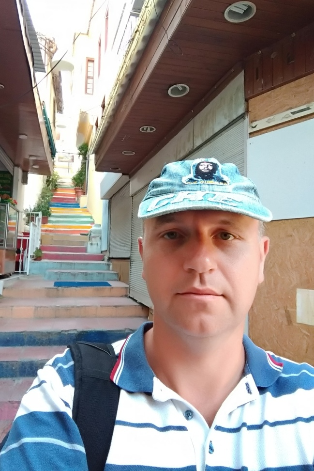

      #Andrei Savastsiyonak
     ```<figure>
            <a>
      
      <figcaption>I am at the bottom of the stairs</figcaption>
            </a>
      </figure>```

      ###Contact me
           
            - country: **Belarus**
            - city: **Minsk**
            - street: **praspiekt imja hazety "Prauda" 16-59**
            - tel: **+375 29 719 78 73**
            - email: **Andddrews@gmail.com**
    
          ##Summary

              Now I am a lecturer at the Institute for Advanced Studies. As a person who has a academic degree and title, I am used to mental work and I know what technical creativity is. I think programming is very close to what I did before.
               
              I am successful at my current job. But my work has become uninteresting to me.
              I have never liked solving crossword puzzles, but Java Script tasks solving makes me happy. 
               
            
              Now it’s rather hard to work not in IT and learn IT.
              If I were a junior programmer, I would learn Java Script faster. My academic degree and title support my ability to set goals and achieve them on my own.

          
         ##Skills

              I have been studying the Front-end since spring 2018. IDE - VScode. I did not finished 2018q3 course last year - game task was difficult for me.
 
     
          ##Examples of Code
           
              I am at the bottom of the stairs, but I have made the first steps.
              [My codewars](https://www.codewars.com/users/Andddrews)
              [My codeacademy](https://www.codecademy.com/AndreiSavastsiyonak)
      
         ##Expirience 
           
               I haven't had any experience as a programmer befor, but I'm full of enthusiasm to start my career right now. 
     
          ##Education
          
              I’ve graduated from the Polatsk State University as a civil engineer.
              Than I was postgraduate student. 
              In 2003 I received the degree of Candidate of Technical Sciences in Belarusian National Technical University
              then the rank of assistant professor.
       
          ##English level
            
              As a student, I additionally studied English. Classes were held on the textbook Headway.
              At the end of study I learned the upper intermediate level. Updating English knowledge is easier than getting it.
              Now my level is intermediate. I have been reading the Third Edition of "Object-Oriented JavaScript" by Ved Antani and Stoyan Stefanov this year. (https://javascript.info/) is easy to read for me too.
        
              It is hard to understand native speakers, you know.
    
    ###Thanks for reading! 
